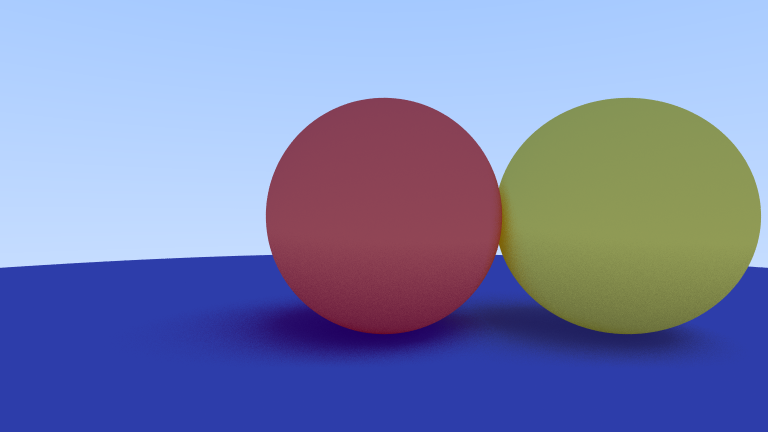

This image was generated with ```example.json```.

- [Installation](#installation)
- [Usage](#usage)
  - [Simple](#simple)
  - [Advanced](#advanced)
- [spheres.json](#spheresjson)

# Installation

```shell
cargo install --git https://github.com/tanguyMichardiere/rray.git
```

# Usage

## Simple

```shell
rray spheres.json
```

## Advanced

```shell
rray <spheres> [-o <output>] [-w <width>] [-h <height>] [-l <camera-location>] [-d <camera-direction>] [-f <focal-length>] [-b <background>]

Options:
  -o, --output      output file name (must end by ".png")
  -w, --width       width of the image to generate (default: 1920)
  -h, --height      height of the image to generate (default: 1080)
  -l, --camera-location
                    location of the camera (default: (0,0,0))
  -d, --camera-direction
                    direction of the camera (default: (0,0,-1))
  -f, --focal-length
                    focal length of the camera (default: 1)
  -b, --background  background of the image (default: blue gradient)
  --help            display usage information
```

# spheres.json

Each sphere is defined by the coordinates of its center, its radius and its color:

```json
[
    {
        "center": {
            "x": 0,
            "y": 0,
            "z": -1
        },
        "radius": 0.5,
        "color": {
            "red": 1,
            "blue": 0,
            "green": 0
        }
    },
    {
        "center": {
            "x": 0,
            "y": -100.5,
            "z": -1
        },
        "radius": 100,
        "color": {
            "red": 0,
            "blue": 0,
            "green": 1
        }
    }
]
```
